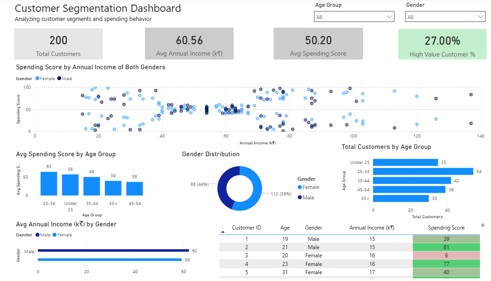
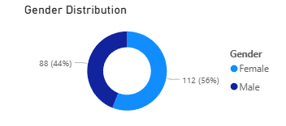

# Customer Segmentation & Behavior Dashboard (Power BI)

## Overview

This project analyzes **customer segmentation and spending behavior** using Power BI.  
The dashboard helps stakeholders understand **customer value, demographic patterns, and spending tendencies** to support data-driven business decisions.

---

## Business Problem

A retail business collects customer demographic and behavioral data but lacks visibility into:

- Which customer segments are the most valuable  
- How spending behavior varies across age groups and gender  
- What proportion of customers can be classified as high-value  

Without these insights, it becomes difficult to:

- Target the right customer segments  
- Design effective retention strategies  
- Align marketing and sales efforts with customer value  

---

## Dashboard Objectives

The dashboard is designed to:

- Identify distinct customer segments using income and spending behavior  
- Highlight high-value customers  
- Analyze spending patterns across age groups and gender  
- Enable customer-focused decision-making  

---

## Key KPIs

| KPI | Description |
|----|------------|
| **Total Customers** | Total number of customers |
| **Average Annual Income** | Average income of customers |
| **Average Spending Score** | Overall customer spending tendency |
| **High-Value Customers (%)** | Percentage of customers with high spending scores |

---

## Key Visuals

### Dashboard Overview

---

### Customer Segmentation (Income vs Spending)
- Scatter plot of **Annual Income vs Spending Score**
- Reveals distinct customer segments and spending patterns

---

### Average Spending Score by Age Group
- Compares spending behavior across age segments
- Highlights age groups contributing higher customer value

---

### Customer Distribution by Age Group
- Shows customer base composition by age
- Helps assess demographic concentration

---

### Gender Distribution
- Displays customer distribution by gender
- Supports demographic-level analysis

---

### High-Spending Customers Table
- Customer-level details with conditional formatting
- Highlights high-spending customers for quick identification

---

## Key Insights

- Spending behavior varies significantly across age groups.
- A smaller subset of customers contributes disproportionately to higher spending scores.
- Customers with similar income levels can display very different spending behavior.
- Gender-based differences in income and spending exist but are not extreme.
- A meaningful percentage of customers qualify as high-value, indicating strong segmentation potential.

---

## Business Recommendations

- Focus retention strategies on high-value customer segments.
- Use age-based insights to tailor promotions and offers.
- Combine income and spending behavior for personalized targeting.
- Track high-value customer percentage as a key performance indicator.

---

## Tools & Technologies

- **Power BI**
- **DAX** (Aggregations, Percentages, Conditional Logic)

---

## Dataset

- **Description:** Customer-level demographic and spending data  
- **Records:** 200 customers  

https://www.kaggle.com/datasets/shrutimechlearn/customer-data

---

## Notes

- The dataset size is suitable for demonstrating analytical thinking and dashboard design.
- The dashboard prioritizes clarity, interpretability, and business relevance.
- No predictive modeling was applied due to limited historical data.

---

## Future Enhancements

- RFM-based customer segmentation
- Customer lifetime value (CLV) analysis
- Time-based behavioral analysis using transactional data
- Integration with campaign or purchase history

